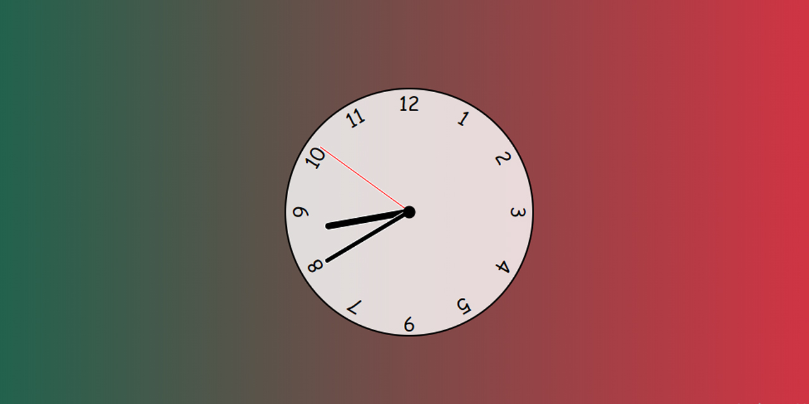

# Analog Clock using JavaScript
This is a Analog Clock using JavaScript. It's showing current time and your local time (from where you browsing).

## Where the time is coming from?
The time is coming from your browser's built in function `new Date()`

Built by: [Shihabiiuc.Com](https://www.shihabiiuc.com/).

_Want to make improvements on this repo? Give me a shout at shihabdinajpur@gmail.com_

